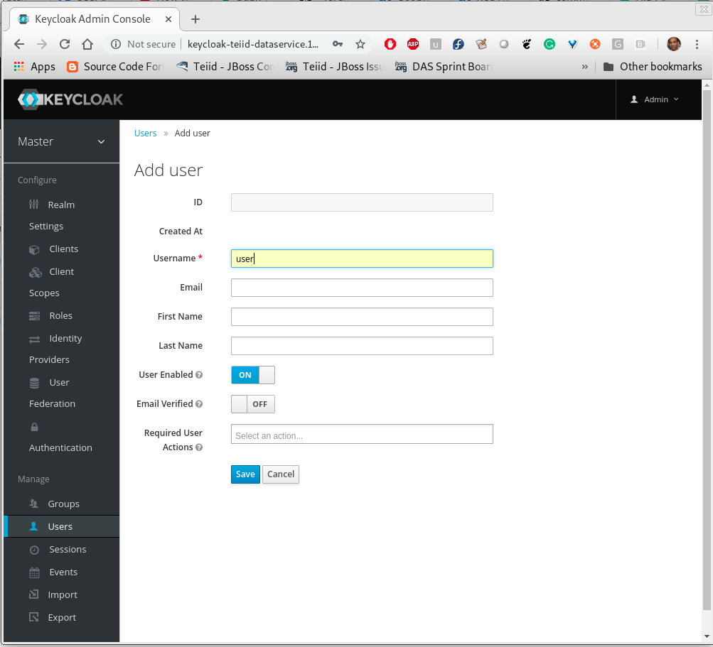
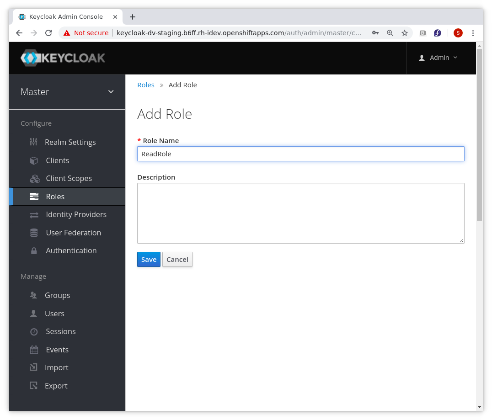
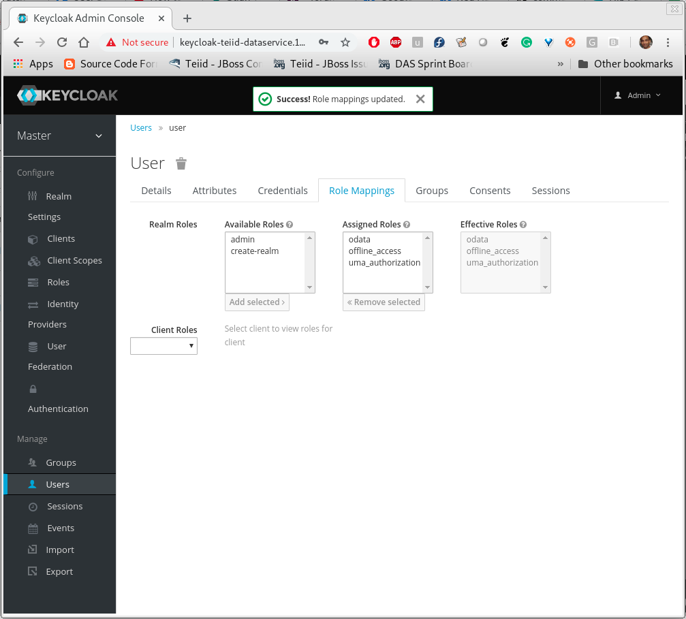
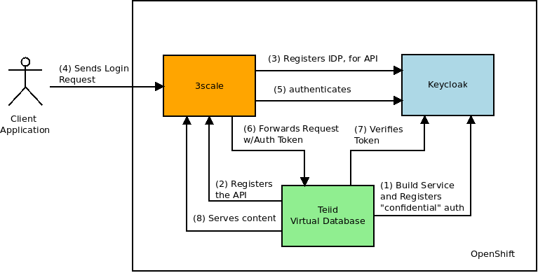

= Securing With OData API Keycloak 

This example is continuation of "rdbms-example", so if you have not gone through that project yet, the tasks in there should be completed first before going through this example.

The main aim in this example is to secure the Data Virtualization's OData API interface using the Keycloak. We will use OpenID-Connect as authentication mechanism to secure the API and use OAuth2 as authorization mechanism. 

Note that in this example, the installation of Keycloak is done using a template file from Keycloak, however if you already have Keycloak environment set up in OpenShift then we suggest you use that instance. We only showing this step here for illustration purposes only.

== [[Install Keycloak]]Install Keycloak

To install Keycloak on the same namespace as your project, execute the following `oc` commands. The first one installs a template, and second one instantiates a Keycloak instance with predefined username and password.

----
oc create --force -f "https://raw.githubusercontent.com/jboss-dockerfiles/keycloak/master/openshift-examples/keycloak-https.json"
oc process keycloak-https -p KEYCLOAK_USER=admin -p KEYCLOAK_PASSWORD=admin -p NAMESPACE=`oc project -q` | oc create -f -
----

Note: In future these above command will be replaced with an Operator and CRD.

Now, using log into the OpenShift console using your web browser and find out the route (URL) to your installed Keycloak server. My instance the URL is like

----
https://secure-keycloak-teiid-dataservice.192.168.99.100.nip.io/auth/
----

using your web browser log into the admin console of the Keycloak. This will take you the "master" realm. In this example, I will be using the "master" realm and will be creating a "client" for the Data Integration called "di". Click on the left side navigation on clients

image:images/keycloak1.png[]

Click "create", to create a new client called "di" and select client protocol as "openid-connect" and save.

image:images/keycloak2.png[]

Click "users", to create a new user and provide the name and details to create one. The screen shows creating user by the name "user". Also create second user called "developer". Provide credentials for both of them in credentials tab.

Click "roles", to create a new role and create a role called "odata". This role will be used to validate user's access to the OData service. Repeat this step to add any other roles you want to give your user.

Go back to the "users" panel, find the user you created in the previous step and grant him/her the role of "odata". Note, create any number of roles you need to manage your Data virtualization's RBAC based access and assign them to the user(s). Mapping to LDAP/Active Directory based roles is beyond this example, however it is supported as federation through Keycloak. Refer to Keycloak's documentation.

For this example purpose create another role called `ReadRole` and assign this to the `user`. Create another user called `developer` and assign the `odata` role but without `ReadRole` role, so that you can verify functionality of Data Roles later in the example.

Note that the `odata` is to provide access to the OData API endpoint, where as `ReadRole` is being used in the Data Roles for this application. If you want you could reuse single role for both.

Using your OpenShift console in the Keycloak's project namespace, go to services menu option and find the "keycloak" service and its URL. Note that the service name may be different in your workspace as it depends on the name given during the Keycloak installation.

----
https://keycloak-teiid-dataservice.192.168.99.100.nip.io
----

== [[Keycloak based Security on OData API]]Keycloak based Security on OData API

So far we have setup the Keycloak server in OpenShift and configured it for to be used with Data Integration. But before we can use KeyCloak based security on OData API, the example needs to be modified to make use of the Keycloak. For it make the below code changes.

==== pom.xml
The `pom.xml` needs to be added with additional dependencies for Keycloak, as described below

in the "dependencies" section add

----
<dependency>
  <groupId>org.teiid</groupId>
  <artifactId>spring-keycloak-odata</artifactId>
</dependency> 
----

this should replace previous dependency

----
<dependency>
  <groupId>org.teiid</groupId>
  <artifactId>spring-odata</artifactId>
</dependency> 
----

==== application.properties

The `src/main/resources/application.properties` needs to be added with following additional properties

----
keycloak.realm = master
keycloak.auth-server-url = http://keycloak-teiid-dataservice.192.168.99.100.nip.io/auth
keycloak.ssl-required = external
keycloak.resource = di
keycloak.public-client = true
----

Note that depending on your environment, the above properties may have different values, especially from environment to environment and how you setup your Keycloak server.

==== deploymentconfig.yml

The `src/main/fabric8/deploymentconfig.yml` needs to be added with ENVIRONMENT variables that may be different in different deployments. If you are deploying application in DEV and PROD environments, you need a mechanism to switch the configuration to match that environment without changing the application code.

Most of the properties can be static in nature, but the Auth URL is a location that might change from environment to environment. We can configure this property into a Configmap and access its value from there. To add the property `keycloak.auth-server-url` do following to create a ConfigMap

----
oc create configmap my-config --from-literal=keycloak.auth-server-url=http://keycloak-teiid-dataservice.192.168.99.100.nip.io/auth
----

Above creates a config map called `my-config` in OpenShift, that can be referenced from your deployment config as shown below. Between DEV and PROD make sure the name of the config map name stays same but the contents will vary. Note there are many ways to create config maps, the above is a simple example.

Then in the `src/main/fabric8/deploymentconfig.yml` add

----
- name: KEYCLOAK_AUTHSERVERURL
  valueFrom:
     configMapKeyRef:
       name: <config-name>
       key: keycloak.auth-server-url
----

Note that if you used different realm or client by the environment you would have to adjust all those properties using the deploymentconfig.yml file.

==== customer-vdb.ddl

The previous example's virtual database does not define any Data Roles. Add these following two lines to the .DDL file at `src/main/resources/customer-vdb.ddl`

----
CREATE ROLE ReadRole WITH JAAS ROLE ReadRole;
GRANT SELECT ON TABLE "portfolio.CustomerZip" TO ReadRole
----

In the above, the first line is creating role called "ReadRole" and mapping to the role we created earlier in Keycloak's role with same name of "ReadRole". They can be different, but here for simplicity the same name is used. The second line gives the SELECT permissions to the `portfolio.CustomerZip` View to the user with "ReadRole" grant.

== Build Example

Execute following command to build and deploy a custom Teiid image to the OpenShift.

----
$ mvn clean install -Popenshift -Dfabric8.namespace=`oc project -q`
----

== Post Deployment

Now you should see that the image you deployed into the OpenShift is active and running. It has an OData route to it. Before we proceed, we need to add a "Valid Redirect URIs" for the "di" client we created in Keycloak. Log into Keycloak admin console, click on "clients" from left navigation, select "di" client and provide the "Valid Redirect URIs" field as your OData services root URL appended with "*", for example:

----
http://keycloak-dv-example-odata-teiid-dataservice.192.168.99.100.nip.io/*
----

NOTE: Click "Save", for saving the profile. Note this example used Keycloak template that does not persist configuration changes over the pod restarts. In real world examples, you want to switch the "h2" database into "postgresql" database with persistent volumes for the Keycloak template such that the configuration survives the pod restarts.

==  Testing

Now using the browser you can issue an OData API call such as

----
http://keycloak-rdbms-example-odata-teiid-dataservice.192.168.99.100.nip.io/CustomerZip
----

You will presented with a login page, where you use the user credentials you created in previous steps and access the service. If you use `user` as user name when you login you will be granted to view the data of the customer view. If you used `developer` as the user name the permission to view the customer data is not granted, as the `developer` user does not have the `ReadRole` role. 

Note that urls like `/$metadata` are specifically excluded from security such that they can be discovered by other services.

== [[3scale based API Management]]3scale based API Management

Using 3scale one can manage/monetize on APIs that are available for consumption. Here in this example, the OData API is being managed through 3scale, however the API is secured through Keycloak/RH-SSO. When the user logs in, 3scale will engage in authentication with Keycloak, upon success it will then delegate the security token down to the OData API. OData API will verify the token, and read permissions from token and apply those to the data roles defined on the virtual database. The below diagram illustrates authentication flow.

== Configure 3scale with Keycloak

Here is link:https://developers.redhat.com/blog/2017/11/21/setup-3scale-openid-connect-oidc-integration-rh-sso/[excellent article] written on this subject here  rather than duplicate the information follow this one.

In the above article, go through until Keycloak security realms, and users, roles are created, just short of configuration in the 3scale. You only need to do this very fist time. Then go to next section to configure the Data Virtualization service, once that service is discovered in 3scale, follow through rest of the article.

== Configure Data Virtualization

Follow the same steps in <<Keycloak based Security on OData API, Keycloak based Security on OData API>> however make following additional changes

==== application.properties

The `src/main/resources/application.properties` needs to be replaced with following properties. The values for all the properties come from your Keycloak configuration.

----
keycloak.realm = 3scale-sso
keycloak.auth-server-url = http://keycloak-staging.dev.openshiftapps.com/auth
keycloak.resource = 3scale-admin
keycloak.ssl-required = external
keycloak.public-client = false
keycloak.credentials.secret=4078a69a-9da9-45b8-84d9-5f1171a19aba
keycloak.principal-attribute=preferred_usernamekeycloak.credentials.secret
----

Note that from above you need to externalize the `keycloak.auth-server-url` and `keycloak.credentials.secret` properties into config map, such that they can be changed from environment to environment. For that you can execute a command like

----
oc create configmap my-config --from-literal=keycloak.auth-server-url=http://keycloak-staging.dev.openshiftapps.com/auth --from-literal=keycloak.credentials.secret=4078a69a-9da9-45b8-84d9-5f1171a19aba
----

to create a configmap in OpenShift. Note, there are many other ways to create a configmap.

Note that you can find the value for `keycloak.credentials.secret` property in the Keycloak's admin console under the credentials tab for "3scale-admin" client.

==== deploymentconfig.yml

We need supply the properties that are defined in the config map back into the image by adding following to the `deploymentconfig.yml` file.

----
- name: KEYCLOAK_AUTHSERVERURL
  valueFrom:
     configMapKeyRef:
       name: <config-name>
       key: keycloak.auth-server-url
- name: KEYCLOAK_CREDENTIALS_SECRET
  valueFrom:
     configMapKeyRef:
       name: <config-name>
       key: keycloak.credentials.secret
       
----

where <config-name> in above code fragment is "my-config" in this example. Once these are edits are done follow through rest of the build and testing in the <<Keycloak based Security on OData API, Keycloak based Security on OData API>>. You can skip the "Post Deployment" step in there as it is not needed in this authentication flow.

