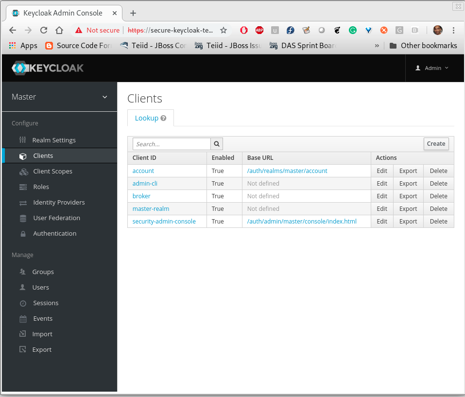
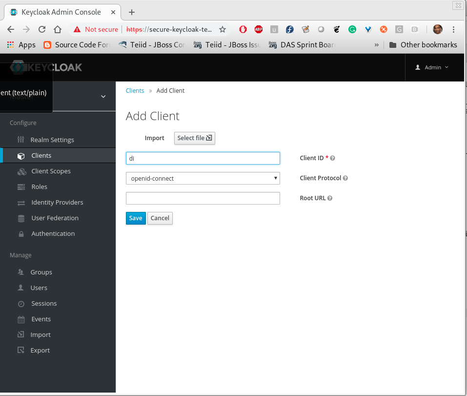

== Install Keycloak

In this example the installation of Keycloak is done using a template file from Keycloak, however if you already have Keycloak environment set up in OpenShift then we suggest you use that instance. We only showing this step here for illustration purposes only.

To install Keycloak on the same namespace as your project, execute the following `oc` commands. The first one installs a template, and second one instantiates a Keycloak instance with predefined username and password.

[source,bash]
----
oc new-app -p KEYCLOAK_USER=admin -p KEYCLOAK_PASSWORD=admin -p NAMESPACE=`oc project -q` -f "https://raw.githubusercontent.com/jboss-dockerfiles/keycloak/master/openshift-examples/keycloak-https.json"
----

NOTE: In the future these above command will be replaced with an Operator and CRD.

NOTE: this example uses a Keycloak template that does not persist configuration changes over the pod restarts. In real world examples, you want to switch the "h2" database into "postgresql" database with persistent volumes for the Keycloak template such that the configuration survives the pod restarts.

Now, using log into the OpenShift console using your web browser and find out the route (URL) to your installed Keycloak server. My instance the URL is like

----
https://secure-keycloak-myproject.192.168.99.100.nip.io/auth/
----

using your web browser log into the admin console of the Keycloak. This will take you the "master" realm. In this example, I will be using the "master" realm and will be creating a "client" for the Data Integration called "di". Click on the left side navigation on clients

Click "create", to create a new client called "di" and select client protocol as "openid-connect" and save.

Click "users", to create a new user and provide the name and details to create one. The screen shows creating user by the name "user". Also create second user called "developer". Provide credentials for both of them in credentials tab.

image:images/keycloak4.png[]

Click "roles", create a role called `ReadRole`

image:images/keycloak3.png[]

You can create as many roles as needed for you users. Mapping to LDAP/Active Directory based roles is beyond this example, however it is supported as federation through Keycloak. Refer to Keycloak's documentation.

Go back to the "users" panel, find the user you created in the previous step and grant him/her the role of "ReadRole".

image:images/keycloak5.png[]

Using your OpenShift console in the Keycloak's project namespace, go to services menu option and find the "keycloak" service and its URL. Note that the service name may be different in your workspace as it depends on the name given during the Keycloak installation.

----
https://keycloak-myproject.192.168.99.100.nip.io
----

Dpending on your RBAC needs create as many users/roles and configure permissions model for it.