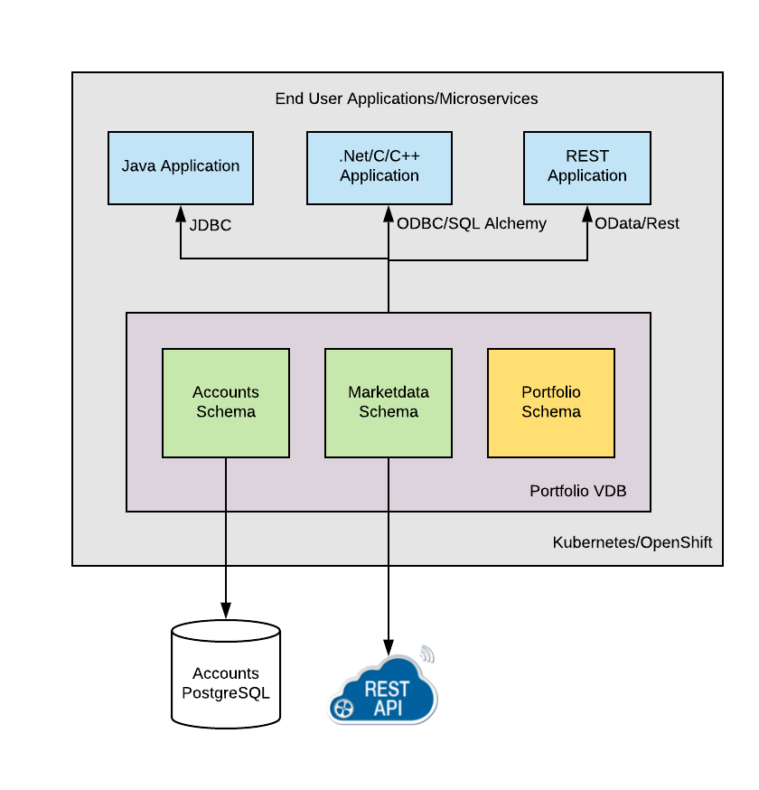

:toc:
# Hello World Teiid Data Federation Example On OpenShift

## Goal

This example will demonstrate the ability of Teiid to integrate multiple datasources so that a single query can return results from all of those sources. If you are not familiar with Teiid nomenclature please take few minutes to read https://teiid.io/about/basics/[basics] that you will be working with.

Time: 30 mins to 1hr
Skill: Beginner
Prerequisites: SQL knowledge

## Install of Teiid

For this example to work we need following software modules be available

* Access to OpenShift 4.x platform. If you are working with a your own laptop and has sufficient resources available and you have access to Red Hat's customer portal you can use https://developers.redhat.com/products/codeready-workspaces/overview[Code Ready Containers (CRC)]. If you are using CRC, install it, start it and make sure it running correctly.

* Install `oc` binary. (content from Hugo doc here)

* Login to OpenShift console using the credentials, and from the OperatorHub menu item make sure 
    ** Teiid (Data Virtualization) Operator is installed.
    ** We need this as example database to be used with in this example. We will install a sample PostgreSQL database and load with sample data.
    ** A SQL Client to be used for testing the Virtual Database. For this we will use SquirreL SQL Client. 

NOTE: Teiid Operator is NOT a cluster wide operator, so it watches single namespace where it is installed. If you need to work in different projects, currently the only option is install this operator in every namespace you want to deploy a Virtual Database.

## Example Explanation

This is example about building a Customer Portfolio. In this example we have a customer's account information in a PostgreSQL database, where he/she owns multiple positions in various stocks in their portfolio. 

In order to know the up to date portfolio value, we need the live stock price quotes to compute the account value. However, as we know stock price is always changing and depends on market. We will use live quoting service that is REST based and get the market values and then compute the account value.

The purpose of data virtualization is to keep inner workings of the data integration at data level and abstract away how the data is combined. This is all done using model driven, and no coding is required.

* Account Information, stored in a PostgreSQL database
* Market Data (Stock prices), obtained from a REST Service

Using the above two sources, we will create a Virtual Database (VDB) in Teiid, that will give access to data in both these data sources. Once the VDB is built you can issue a SQL query spanning both these sources as if they are single source using Teiid. 

We will also create VIEW/TABLE in the VDB, that can encompass the logic of integrating these sources into higher level domain model that exposes the account value. Note that none of these steps are copying the data from your original source(s), the data still resides in original sources, unlike in ETL (extract, Transform and Load) tools. 

You can think of Teiid as Logical Data Warehouse without hassle of moving the data. After you are done building this VDB, you can then access this VDB just like any other database like Oracle, MS-SQLServer, MySQL etc. 

NOTE: For client applications Teiid will look like any another relational database. They do not know anything about how, where, when the data is collected and supplied to the calling application. So effectively, it provides a Data Abstraction layer.

There multiple steps in building this example. We will call this as "Portfolio" VDB. Note that a VDB is nothing but a simple DDL file with metadata about the sources you are trying to integrate together. The steps can be defined as

. Setting up example data sources
. Creating the VDB file (Aka Custom Resource File)
. Deploy the Custom Resource
. Access the VDB using JDBC application. (ODBC is left as exercise to the user)

## Setting up PostgreSQL database with Sample data

In this step we are going to create a PostgreSQL database with a schema to be used in this example. First we need to create an PostgreSQL database instance. For that execute the following

[source, bash]
----
oc new-app -f postgresql-ephemeral-template.json \
  -p DATABASE_SERVICE_NAME=accounts \
  -p POSTGRESQL_USER=user \
  -p POSTGRESQL_PASSWORD=changeit \
  -p POSTGRESQL_DATABASE=accounts
----

[source, bash]
----
oc get pods | grep accounts
----

Find the pod starting with `accounts-xxxxx` and connect to it by executing

[source, bash]
----
# copy schema file to remote pod directory
oc rsync . accounts-xxxxx:/tmp
----

NOTE: You might see an error here saying `rsync: failed to set permissions on "/tmp/.": Operation not permitted (1)` you can safely ignore that and go to next step.

Using the OpenShift Console, go the `accounts-xxxxx` pod and open the Terminal, and when you have the prompt execute following to populate the Database with some sample data.

[source, bash]
----
psql -U user -d accounts -f /tmp/accounts-schema.sql
----

one could alternatively execute below to populate the database too, however with my current cluster we are having some permission issues with this

[source, bash]
----
# use psql to connect to database and create some tables
oc rsh accounts-xxxxx psql -U user -d accounts -f /tmp/accounts-schema.sql
----

Now, PostgreSQL database is setup to be used.

## Quote Service
In order to get stock price quotes lets use a Online Quote service from https://finnhub.io/api/v1/

api-key: bq0bisvrh5rddd65fs70

## Building the Virtual Database (VDB)

In this step we will go through and build using any text editor. Currently we are working on a VSCode editor however it is not ready to be used.

### Configuring the Data Sources
The Base CR Starts as, where we will configure the DataSources to be used

[source,yaml]
----
apiVersion: teiid.io/v1alpha1
kind: VirtualDatabase
metadata:
  name: portfolio
spec:
  replicas: 1
  datasources:
    - name: accountdb
      type: postgresql
      properties:
        - name: username
          value: user
        - name: password
          value: changeit
        - name: jdbc-url
          value: jdbc:postgresql://accounts/accounts
    - name: quotesvc
      type: rest
      properties:
        - name: endpoint
          value: https://finnhub.io/api/v1/
----

In the above CR, we configured two Data Sources `accountdb` to represent the PostgreSQL database and `quotesvc` to represent the REST API for getting the Quotes. Let's now define the DDL for the VDB.

NOTE: the datasource name MUST be defined in lowercase.

### Building the VDB in DDL

The Virtual Database is always defined in the from of DDL. This DDL contains the 

[source,yaml]
----
spec:
  build:
    source:
      ddl: |
       <ddl for vdb goes here>
----

Let's incrementally build the Virtual Database.

#### VDB definition

In the below DDL, we are creating a database called `Portfolio` and using it.

[source, sql]
----
CREATE DATABASE Portfolio OPTIONS (ANNOTATION 'The Portfolio VDB');
USE DATABASE Portfolio;
----

#### Translator definition

In order for Teiid to get work with data it receives from external sources which can any format, it needs adapters that are called "Translators" or "Data Wrappers" to convert the data into known format. Below snippet defines data wrappers for both the sources in this example. Here `rest` and `postgresql` are the data wrappers. Teiid supports many different Data Wrappers different data sources.

[source, sql]
----
CREATE FOREIGN DATA WRAPPER rest;
CREATE FOREIGN DATA WRAPPER postgresql;
----

#### External Source definitions

In order for Teiid to get data from external sources, it needs connections to those external sources, in previous sections we defined the configuration for these data sources, now here we are tieing that configuration with Virtual Database semantics called "SERVER" which simply represents a connection. This connection is also will be marked to use a DATA WRAPPER.

[source, sql]
----
CREATE SERVER "accountdb" FOREIGN DATA WRAPPER postgresql;
CREATE SERVER "quotesvc" FOREIGN DATA WRAPPER rest;
----

### Schema definition

Teiid's Virtual Database is a collection of multiple schemas. These schemas can be PHYSICAL, that represent a foreign source like above PostgreSQL or can be VIRTUAL where the schema is only available Teiid layer. 

[source, sql]
----
CREATE SCHEMA marketdata SERVER "quotesvc";
CREATE SCHEMA accounts SERVER "accountdb";

CREATE VIRTUAL SCHEMA Portfolio;
----

A PHYSICAL schema represents the data elements in FOREIGN source, thus they reference the SERVER that is created in the previous step.

### Importing of Metadata

We have defined the SCHEMA in previous step and associated with SERVER, however by default Teiid does not know underlying schema in those sources, the metdata for those schema's can be explicitly imported by adding the following. One can also give full metadata (Tables, Procedures etc) here which is highly recommended, however for this example purpose, we will dynamically import that information.

[source, sql]
----
SET SCHEMA marketdata;
IMPORT FROM SERVER "quotesvc" INTO marketdata;

SET SCHEMA accounts;
IMPORT FROM SERVER "accountdb" INTO accounts OPTIONS (
        "importer.useFullSchemaName" 'false',
        "importer.tableTypes" 'TABLE,VIEW');
----

### Defining the VIRTUAL Schema

This is where data abstraction layer of the Virtual Database is defind. Here one can define a schema using the elements of the metadata that is defined in the PHYSICAL schemas from above. The user can define any number of VIRTUAL schema layers as they want, here we are showing a single layer.

[source, sql]
----
SET SCHEMA Portfolio;
           
CREATE VIEW StockPrice (
    symbol string PRIMARY KEY,
    price bigdecimal
) AS  
    SELECT SP.symbol, SP.price
    FROM (EXEC MarketData.getTextFiles('*.txt')) AS f, 
    TEXTTABLE(f.file COLUMNS symbol string, price bigdecimal HEADER) AS SP;
          
CREATE VIEW AccountValues (
    LastName string PRIMARY KEY,
    FirstName string,
    StockValue bigdecimal
) AS
    SELECT c.lastname as LastName, c.firstname as FirstName, sum((h.shares_count*sp.price)) as StockValue 
    FROM Customer c JOIN Account a on c.SSN=a.SSN 
    JOIN Holdings h on a.account_id = h.account_id 
    JOIN product p on h.product_id=p.id 
    JOIN StockPrice sp on sp.symbol = p.symbol
    WHERE a.type='Active'
    GROUP BY c.lastname, c.firstname;
----

We setup two virtual VIEWS above, `StockPrice` gets stock price from the `quotessvc`, and the `AccountValues` view using `StockPrice` view builds the account value of the customers in the `AccountsDB` database.

This value proposition of the Data Virtualization is the end user is only sees `AccoutValue` and `StockPrice` view, they do not know how this data is integrated together.

### Full Example CR

Lets bring all the components together from above to build the complete Custom Resource file.

[source,yaml]
.portfolio.yaml
----
apiVersion: teiid.io/v1alpha1
kind: VirtualDatabase
metadata:
  name: portfolio
spec:
  replicas: 1
    expose:
    - LoadBalancer
  datasources:
    - name: accountdb
      type: postgresql
      properties:
        - name: username
          value: user
        - name: password
          value: password
        - name: jdbc-url
          value: jdbc:postgresql://accounts/accounts
    - name: quotesvc
      type: rest
      properties:
        - name: endpoint
          value: https://finnhub.io/api/v1/
  build:
    source:
      ddl: |
        CREATE DATABASE Portfolio OPTIONS (ANNOTATION 'The Portfolio VDB');
        USE DATABASE Portfolio;

        --############ translators ############
        CREATE FOREIGN DATA WRAPPER rest;
        CREATE FOREIGN DATA WRAPPER postgresql;

        --############ Servers ############
        CREATE SERVER "accountdb" FOREIGN DATA WRAPPER postgresql;
        CREATE SERVER "quotesvc" FOREIGN DATA WRAPPER rest;

        --############ Schemas ############
        CREATE SCHEMA marketdata SERVER "quotesvc";
        CREATE SCHEMA accounts SERVER "accountdb";

        CREATE VIRTUAL SCHEMA Portfolio;

        --############ Schema:marketdata ############
        SET SCHEMA marketdata;

        IMPORT FROM SERVER "quotesvc" INTO marketdata;

        --############ Schema:accounts ############
        SET SCHEMA accounts;

        IMPORT FROM SERVER "accountdb" INTO accounts OPTIONS (
                "importer.useFullSchemaName" 'false',
                "importer.tableTypes" 'TABLE,VIEW');

        --############ Schema:Portfolio ############
        SET SCHEMA Portfolio;
                  
        CREATE VIEW StockPrice (
            symbol string,
            price double,
            CONSTRAINT ACS ACCESSPATTERN (symbol)
        ) AS  
            SELECT p.symbol, y.price
            FROM accounts.PRODUCT as p, TABLE(call invokeHttp(action=>'GET', endpoint=>QUERYSTRING('quote', p.symbol as "symbol", 'bq0bisvrh5rddd65fs70' as "token"), headers=>jsonObject('application/json' as "Content-Type"))) as x, 
            JSONTABLE(JSONPARSE(x.result,true), '$' COLUMNS price double path '@.c') as y

        CREATE VIEW AccountValues (
            LastName string PRIMARY KEY,
            FirstName string,
            StockValue double
        ) AS
            SELECT c.lastname as LastName, c.firstname as FirstName, sum((h.shares_count*sp.price)) as StockValue 
            FROM Customer c JOIN Account a on c.SSN=a.SSN 
            JOIN Holdings h on a.account_id = h.account_id 
            JOIN product p on h.product_id=p.id 
            JOIN StockPrice sp on sp.symbol = p.symbol
            WHERE a.type='Active'
            GROUP BY c.lastname, c.firstname;
----

## Deploy the VDB

To deploy the above Virtual Database, execute the following.

[source,sh]
----
oc create -f portfolio.yaml
----

This deployment process can take 4-5 minutes for very first time, as the Operator builds a base image to use any subsequent deployments. You can test status by issuing following command

[source,sh]
----
oc get vdb portfolio -o yaml | grep phase 
----

On successfull deployment you will see `phase: Running`, then you are ready for issuing the queries against this database.

## Access the Virtual Database

Now that the Virtual database is deployed,there are many different ways to access the views you created in Teiid.

### Access using JDBC

#### Access from another in cluster client

JDBC connection to this database can be accessed from other services in cluster with out further configuration. The details for the service can be found by issuing 

----
oc get service portfolio
----

You can test this using a test client like below

[source,bash]
----
oc run -it --restart=Never --attach --rm --image quay.io/asmigala/sqlline:latest sqlline 
----

The above will install this image in the cluster, and will open a prompt like below

[source,bash]
----
sqlline>
----

Enter the following to connect to the `portfolio` database created.

[source,bash]
----
sqlline> !connect jdbc:teiid:portfolio@mm://portfolio:31000;

Enter username for jdbc:teiid:portfolio@mm://portfolio:31000;: foo
Enter password for jdbc:teiid:portfolio@mm://portfolio:31000;: ****

0: jdbc:teiid:portfolio@mm://portfolio:31000>
----

You can enter following general commands here to help with tool

[source,bash]
----
!dbinfo
!tables
!help
!quit
----

You can execute any sample queries at this prompt. Look below for for sample queries, in the "Testing with JDBC Client" section below. 

See more details about JDBC xref:../../jdbc.adoc[here]

NOTE: You can skip below sections as they just show different ways of accessing the database.

#### External Access using Load Balancer

These above services can be only accesses inside the cluster through another application, if you need external access, one needs to create _LoadBancer_ service that will open up an external port that can be accessed outside OpenShift.

See in the about Custom Resource, the `LoadBalancer` service exposed, when this configuration is defined, the Operator tries to create a LoadBalancer Ingress

NOTE: Depending upon the OpenShift cluster you are working with this may not work, may not have permissions

To find the external-ip you can execute 
[source, bash]
----
$oc get svc portfolio-external
----

which should provide the host name and port to connect to for both using Teiid JDBC and PostgreSQL protocol.

You can find exposed host and port by executing

[source, bash]
----
oc get svc portfolio-external -o=jsonpath='{..ingress[0].hostname}'
----

This will yield a hostname like

----
A4d3bf5fd1b9311eab2b602474b8b0b4-143190945.example.opentlc.com
----

NOTE: Depending upon the OpenShift cluster you are working with this may not work, and/or may not have permissions. Also, in OpenShift 4.x this ONLY works if there is external load balancer is configured. 

#### External Access Using Port Forward

In situations where external Load Balancer can not be configured, for testing pusposes you can open local port on your machine using the below command. 

[source,bash]
----
oc port-forward $(oc get pods -o=jsonpath='{.items[0].metadata.name}' -l app=portfolio) 31000
----

when using this method one need to use `localhost` as hostname and `31000` for JDBC port.

### Testing With JDBC Client

To test one can use  http://squirrel-sql.sourceforge.net/[SquirreL] to access the VDB. SquirreL is JDBC client tool, using which you can access any database. This is only suggestion, but you can use any of your favorite JDBC Client tools.

* Download this tool from the link provided, and install using directions http://squirrel-sql.sourceforge.net/#installation[here]

* Download the Teiid java driver from Teiid's download page http://teiid.io/teiid_wildfly/downloads/[See JDBC Driver links]

* Start the SquirreL, and then add a driver for Teiid. See the screen shots  http://squirrel-sql.sourceforge.net/index.php?page=screenshots[here], then use following settings

----
Name: Teiid
Example URL: jdbc:teiid:<vdb-name>@mms://<host>:<port>
Website URL: http://teiid.org
----

NOTE: you need to add the JDBC driver download above in the "Extra Class Path" tab, and select "Class Name" at the bottom as "org.teiid.jdbc.TeiidDriver". 

* Click on Alias tab, and create an alias, using the driver created above, use the following settings for alias

----
Name: portfolio
Driver: Teiid
URL: jdbc:teiid:portfolio.1@mm://127.0.0.1:31000
User: <user>
Password: <password>
----

Test your connection, then press OK. Then right click on alias created, and choose "connect" to connect to the VDB and issue SQL queries like below and see the results.

[source,SQL]
.Sample queries
----
-- Find current stock price of IBM stock
SELECT * FROM STOCKPRICE WHERE symbol = 'IBM';

-- find the full account value for customer with last name 'Dragon'
SELECT * FROM AccountValues WHERE LastName = 'Dragon';
----

### Accessing the virtual database through the OData API

You can access the virtual database through an OData (Open Data Protocol) API.
OData is a standard open source REST interface for interacting with multiple data sources. 

Before you can set up OData access to the virtual database, you must know the OData route to the virtual database service.

. From a terminal window type the following command to retrieve the OData route for the virtual database service:
+
[source,bash]
----
$oc get vdb <virtual-database-name> -o yaml | grep route
----
+
For example,
+
[source,bash]
----
$oc get vdb dv-customer -o yaml | grep route
----
+
The command returns the following output:
+
[source,bash]
----
route: https://dv-customer-demo.apps-crc.testing/odata
----
+
Now that you have the route, you can use it to query the virtual database service. 
. For example, type the following command to retrieve an account value from the _Portfolio_ virtual database 
for the user with the name _Dragon_:
+ 
[source, bash]
----
https://{host}/odata/portfolio/AccountValues('Dragon')?$format=json

----
+
NOTE: Replace the {host} value with the route value that you retrieved in the Step 1.
+
The command returns a result similar to the following JSON snippet:
+
----
{
   "@odata.context":"https://{host}/odata/portfolio/$metadata#AccountValues/$entity",
   "LastName":"Dragon",
   "FirstName":"Bonnie",
   "StockValue":30299.04
}
----
